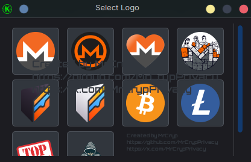

# QR Generator — Private & Offline QR Code Generator

<div align="center">
  
</div>


## <div align="center"> What is QR Generator?

QR Generator is a **100% offline** application designed to create customized QR codes for wallets, addresses, or any text you need.

- **Total Privacy:** No logs are stored, no internet connection required, no external services used.  
- **Easy to Use:** Clean and modern interface working on Linux, Windows, and WSL.  
- **Customizable:** Change colors, add logos, and generate QR codes hassle-free. 

⚠️ **Warning**: Some color combinations may not be recognized by all scanners. Always test your QR code before using or sharing it. 

This tool is perfect for users who value their privacy and want full control over their data.


<div align="center">
  
</div>

<div align="center">
  
</div>


---

## <div align="center"> Key Features

- Generate QR codes locally without sending any data online.  
- Easy copy and paste functionality for addresses or text input.  
- Option to include custom logos inside the QR code.  
- Compatible with Linux, Windows, and Windows Subsystem for Linux (WSL).  
- Lightweight, fast, and simple design.

---

## <div align="center"> How to Use (From Source)

### On Linux

1. Clone the repository:
    ```bash
    git clone https://github.com/MrCrypPrivacy/qr_generator.git
    cd qr_generator
    ```
2. Install dependencies (recommended to use a virtual environment):
    ```bash
    python3 -m venv venv
    source venv/bin/activate
    pip install -r requirements.txt
    ```
3. Run the app:
    ```bash
    python3 main.py
    ```

### On Windows

1. Download and install [Python 3.10+](https://www.python.org/downloads/windows/).  
2. Open PowerShell or CMD, clone the repo:
    ```powershell
    git clone https://github.com/MrCrypPrivacy/qr_generator.git
    cd qr_generator
    ```
3. Create and activate a virtual environment:
    ```powershell
    python -m venv venv
    .\venv\Scripts\activate
    ```
4. Install dependencies:
    ```powershell
    pip install -r requirements.txt
    ```
5. Run the app:
    ```powershell
    python main.py
    ```

### On WSL (Windows Subsystem for Linux)

Follow the same instructions as for Linux.


> 💡 **Prefer a ready-to-run version?** Scroll down to **Executables Available**.


---

## <div align="center"> Current Status and Upcoming Features

This is the **first version** of QR Generator.

Soon to come:

- Native executables for Windows, Linux, and macOS.  
- Easy installers for your operating system.  
- Visual improvements and new features.

If you've cloned this repository manually, you can update it at any time with:

1. Update the App:
    ``` 
    git pull
    ```
---

## <div align="center"> Executables Available

Pre-built standalone executables are now available. No need to install Python or dependencies.

- ✅ **Windows**: `.exe` standalone version
- ✅ **Linux**: standalone binary
- ⏳ **macOS**: coming soon

 You can find the executables here: ([**Releases**](https://github.com/MrCrypPrivacy/qr_generator/releases))

- [Download for Windows](https://github.com/MrCrypPrivacy/qr_generator/releases/download/v1.0.0/QRGenerator-windows.exe)
- [Download for Linux](https://github.com/MrCrypPrivacy/qr_generator/releases/download/v1.0.0/QrGenerator.linux)

🔧 **Coming soon:** Easy-to-use installers for **Windows**, **Linux**, and **macOS**.

Stay tuned!


---

## <div align="center"> Security & Privacy

- The app **never connects to the internet**.  
- No user data or generated QR codes are logged or stored.  
- Everything happens locally and privately.

**<div align="center"> Use QR Generator with complete peace of mind.** </div>

---

## <div align="center"> Want to Help or Contribute?

The project is open and hosted on GitHub. Your suggestions, issues, and pull requests are very welcome!

---

## <div align="center"> Contact

<div align="center" style="margin: 10px 0;">
  <a href="https://x.com/MrCrypPrivacy" target="_blank" rel="noopener noreferrer">
    
  </a>
</div>


---

**Thank you for using QR Generator!**  
Protect your privacy by generating QR codes without compromising your data!

---

*(This project is licensed under MIT. See the [LICENSE](/LICENSE) file for details.)*


## <div align="center"> Support / Donate

If you'd like to support this project, you can donate privately:

<div align="center">

| **Monero (XMR):** | **Bitcoin Silent Payments (BTC):** |
|-------------------|-----------------------------------|
| <p align="center"></p> | <p align="center"></p> |

</div>

